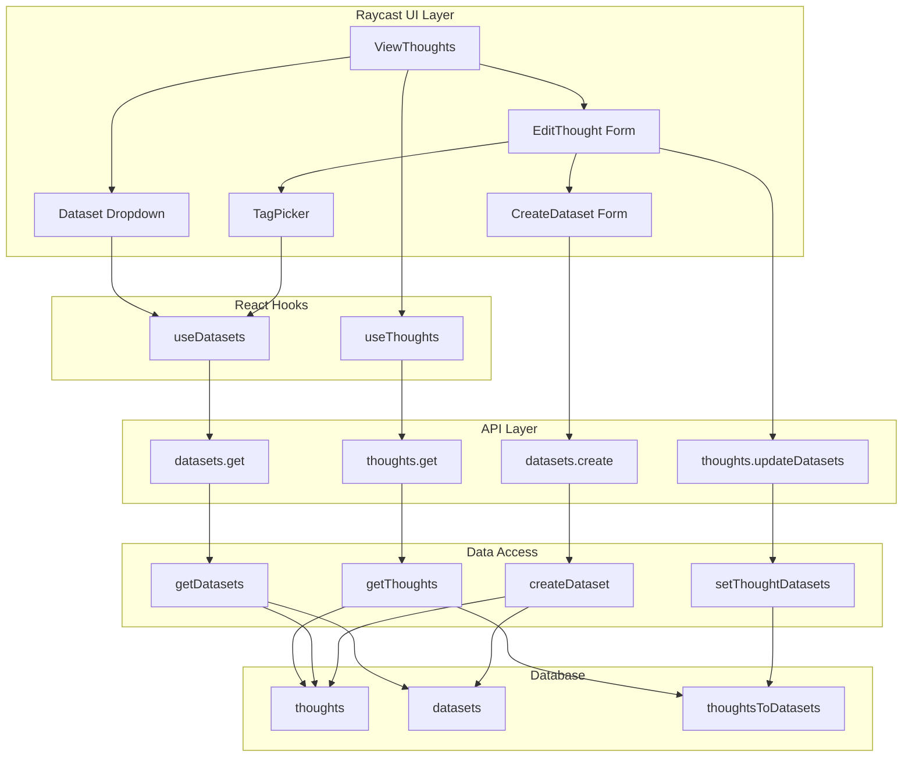

# Datasets Feature Implementation

## Overview

Add datasets as a first-class construct with:

- Dedicated `datasets` table with `extendingThoughtId` (1-1 to representing thought)
- `thoughtsToDatasets` junction table for many-to-many membership
- Server-side filtering and search for both thoughts and datasets
- UI: dropdown filter in View Thoughts, TagPicker in Edit Thought, dataset creation form

---

## Phase 1: Database Schema

### 1.1 Create `datasets` Table

**File:** `[packages/internal/data-store/src/tables/datasets.ts](packages/internal/data-store/src/tables/datasets.ts)` (new)

```typescript
import { index, pgTable, timestamp, varchar } from "drizzle-orm/pg-core"
import { nanoid } from "nanoid"

export const datasets = pgTable(
    "datasets",
    {
        id: varchar().primaryKey().$defaultFn(nanoid),
        brainId: varchar().notNull(),
        extendingThoughtId: varchar(),  // 1-1 to thoughts.id (nullable initially)
        createdAt: timestamp().notNull().defaultNow(),
        updatedAt: timestamp()
            .notNull()
            .defaultNow()
            .$onUpdateFn(() => new Date())
    },
    table => [
        index("datasets_brain_id_created_at_idx").on(table.brainId, table.createdAt)
    ]
)
```

### 1.2 Create `thoughtsToDatasets` Junction Table

**File:** `[packages/internal/data-store/src/tables/thoughts-to-datasets.ts](packages/internal/data-store/src/tables/thoughts-to-datasets.ts)` (new)

```typescript
import { pgTable, primaryKey, timestamp, varchar } from "drizzle-orm/pg-core"

export const thoughtsToDatasets = pgTable(
    "thoughts_to_datasets",
    {
        thoughtId: varchar().notNull(),
        datasetId: varchar().notNull(),
        brainId: varchar().notNull(),
        createdAt: timestamp().notNull().defaultNow()
    },
    table => [
        primaryKey({ columns: [table.thoughtId, table.datasetId] })
    ]
)
```

### 1.3 Export New Tables

**File:** `[packages/internal/data-store/src/tables/index.ts](packages/internal/data-store/src/tables/index.ts)`

Add exports:

```typescript
export * from "./datasets"
export * from "./thoughts-to-datasets"
```

### 1.4 Add JSDoc to Deprecate `kind` Column

**File:** `[packages/internal/data-store/src/tables/thoughts.ts](packages/internal/data-store/src/tables/thoughts.ts)`

Add JSDoc to the `kind` column:

```typescript
/**
 * @deprecated Remove this column if it remains unused after datasets are fully implemented via dedicated tables and relations. The original intent was to discriminate primitive types (datasets, attributes, preferences) within a single thoughts table, but separate tables are more performant for queries.
 */
kind: varchar({ enum: ["dataset", "attribute", "preference"] }),
```

### 1.5 Define Relations

**File:** `[packages/internal/data-store/src/relations/index.ts](packages/internal/data-store/src/relations/index.ts)`

Add relations using Drizzle 1.0 beta `through` syntax:

```typescript
// Add to existing relations object:

datasets: {
    extendingThought: r.one.thoughts({
        from: r.datasets.extendingThoughtId,
        to: r.thoughts.id
    }),
    thoughts: r.many.thoughts({
        from: r.datasets.id.through(r.thoughtsToDatasets.datasetId),
        to: r.thoughts.id.through(r.thoughtsToDatasets.thoughtId)
    })
},

// Update thoughts relations to add:
thoughts: {
    // ... existing relations (fromJoins, toJoins, metadata)
    datasets: r.many.datasets({
        from: r.thoughts.id.through(r.thoughtsToDatasets.thoughtId),
        to: r.datasets.id.through(r.thoughtsToDatasets.datasetId)
    })
},

// Add brain relation:
brains: {
    // ... existing relations
    datasets: r.many.datasets({
        from: r.brains.id,
        to: r.datasets.brainId
    }),
    thoughtsToDatasets: r.many.thoughtsToDatasets({
        from: r.brains.id,
        to: r.thoughtsToDatasets.brainId
    })
}
```

### 1.6 Run Migration

Generate and run Drizzle migration to create the new tables.

---

## Phase 2: Data Shapes (Schemas)

### 2.1 Create Dataset Schemas

**File:** `[packages/public/data-shapes/src/altered-datasets/db.ts](packages/public/data-shapes/src/altered-datasets/db.ts)` (new)

```typescript
import { type } from "arktype"

export const datasetSchema = type({
    id: "string",
    brainId: "string",
    extendingThoughtId: "string | null",
    createdAt: "Date",
    updatedAt: "Date"
})

export const creatableDatasetSchema = datasetSchema.omit("createdAt", "updatedAt").merge({
    "id?": "string",
    "brainId?": "string"  // Injected from context
})

export const updatableDatasetSchema = type({
    "extendingThoughtId?": "string | null"
})

export const queryableDatasetSchema = datasetSchema.pick("id")

export type Dataset = typeof datasetSchema.infer
export type CreatableDataset = typeof creatableDatasetSchema.infer
export type UpdatableDataset = typeof updatableDatasetSchema.infer
export type QueryableDataset = typeof queryableDatasetSchema.infer
```

**File:** `[packages/public/core/src/altered-datasets/index.ts](packages/public/core/src/altered-datasets/index.ts)` (new)

Replicate pure TypeScript types for lightweight consumption in the Raycast extension (no arktype dependency):

```typescript
export type Dataset = {
    id: string
    brainId: string
    extendingThoughtId: string | null
    createdAt: Date
    updatedAt: Date
}

export type CreatableDataset = {
    id?: string
    brainId?: string
    extendingThoughtId?: string | null
}

export type UpdatableDataset = {
    extendingThoughtId?: string | null
}

export type QueryableDataset = {
    id: string
}

export type DatasetWithThought = Dataset & {
    extendingThought: {
        id: string
        alias: string | null
        content: string | null
    } | null
}
```

### 2.2 Create Filter and Search Schemas (Generalized)

These schemas are generalized for reuse across multiple data types (thoughts, datasets, etc.), similar to `packages/public/data-shapes/src/pagination`.

**File:** `[packages/public/data-shapes/src/filter/index.ts](packages/public/data-shapes/src/filter/index.ts)` (new)

```typescript
import { type } from "arktype"

/**
 * Generic filter schema for querying entities.
 * Extend or specialize per entity type as needed.
 */
export const filterOptionsSchema = type({
    "include?": {
        "ids?": "string[]"  // Generic ID filtering
    }
})

/**
 * Thoughts-specific filter extending base filter.
 */
export const thoughtsFilterSchema = type({
    "include?": {
        "datasets?": "string[]"  // Dataset IDs to filter by
    }
})

export type FilterOptions = typeof filterOptionsSchema.infer
export type ThoughtsFilter = typeof thoughtsFilterSchema.infer
```

**File:** `[packages/public/data-shapes/src/search/index.ts](packages/public/data-shapes/src/search/index.ts)` (new)

```typescript
import { type } from "arktype"

/**
 * Generic search options schema for querying entities.
 * 
 * - `query`: The search string
 * - `keyPaths`: Optional array of fields to search (defaults to all searchable fields)
 * - `fuzzy`: Enable fuzzy matching (more expensive, better UX for typos)
 */
export const searchOptionsSchema = type({
    "query?": "string",
    "keyPaths?": "string[]",
    "fuzzy?": "boolean"  // Default: false (uses exact ILIKE matching)
})

export type SearchOptions = typeof searchOptionsSchema.infer
```

**File:** `[packages/public/core/src/filter/index.ts](packages/public/core/src/filter/index.ts)` (new)

Pure TypeScript types for lightweight client consumption:

```typescript
export type FilterOptions = {
    include?: {
        ids?: string[]
    }
}

export type ThoughtsFilter = {
    include?: {
        datasets?: string[]
    }
}
```

**File:** `[packages/public/core/src/search/index.ts](packages/public/core/src/search/index.ts)` (new)

```typescript
export type SearchOptions = {
    query?: string
    keyPaths?: string[]
    fuzzy?: boolean
}
```

### 2.3 Export New Schemas

**File:** `[packages/public/data-shapes/src/index.ts](packages/public/data-shapes/src/index.ts)`

Add:

```typescript
export * from "./altered-datasets"
```

**File:** `[packages/public/data-shapes/src/altered-thoughts/index.ts](packages/public/data-shapes/src/altered-thoughts/index.ts)`

Add:

```typescript
export * from "./filter"
```

---

## Phase 3: Data Access Layer

### 3.1 Create Datasets Data Access Functions

**Directory:** `[packages/internal/data-access/src/datasets/](packages/internal/data-access/src/datasets/)` (new)

#### 3.1.1 `get/index.ts` - Get Datasets with Pagination and Search

Mirror the structure of `[packages/internal/data-access/src/thoughts/get/index.ts](packages/internal/data-access/src/thoughts/get/index.ts)`:

```typescript
/**
 * @todo [P3] Generalize pagination, filtering, and search into a reusable data access factory
 * function that can be used for both datasets and thoughts (and future entities). This would
 * reduce code duplication and ensure consistent behavior across all entity types.
 * 
 * Example future API:
 * ```typescript
 * const getDatasets = createEntityGetter({
 *     table: datasets,
 *     searchableFields: ["extendingThought.alias", "extendingThought.content"],
 *     relations: { extendingThought: true }
 * })
 * ```
 */
export async function getDatasets({
    pagination,
    search,
    context: { brainId, db }
}: {
    pagination: PaginationOptions
    search?: SearchOptions
    context: { brainId: string | null; db: Database }
}): Promise<{ datasets: DatasetWithThought[] | null; hasMore: boolean }>
```

- Use cursor pagination (same pattern as thoughts)
- Join with `thoughts` table via `extendingThoughtId` to get alias/content
- Apply search on joined thought's alias/content (see Section 3.5 for search strategy)
- Return `DatasetWithThought` type that includes the extending thought data

#### 3.1.2 `create.ts` - Create Dataset

```typescript
export async function createDataset({
    dataset,
    extendingThought,
    db
}: {
    dataset: { brainId: string }
    extendingThought: { alias: string; content?: string }
    db: Database
}): Promise<Dataset>
```

- Create the extending thought first
- Create the dataset with `extendingThoughtId` pointing to the thought
- Return the created dataset

#### 3.1.3 `update.ts` - Update Dataset

```typescript
export async function updateDataset({
    query,
    values,
    context
}: {
    query: { id: string; brainId: string }
    values: UpdatableDataset
    context: { db: Database }
}): Promise<Dataset>
```

#### 3.1.4 `delete.ts` - Delete Dataset

```typescript
export async function deleteDataset({
    id,
    brainId,
    db
}: {
    id: string
    brainId: string
    db: Database
}): Promise<Dataset>
```

**Cascade Handling Strategy:**

Since we're using Drizzle relations (not foreign key constraints), cascading must be handled at the application level:

```typescript
export async function deleteDataset({ id, brainId, db }) {
    // 1. Delete all junction table entries (thought memberships)
    await db.delete(thoughtsToDatasets)
        .where(and(
            eq(thoughtsToDatasets.datasetId, id),
            eq(thoughtsToDatasets.brainId, brainId)
        ))
    
    // 2. Delete the dataset itself
    const [deleted] = await db.delete(datasets)
        .where(and(eq(datasets.id, id), eq(datasets.brainId, brainId)))
        .returning()
    
    // 3. Optionally delete the extending thought (or leave orphaned)
    // Decision: Leave the extending thought - it may have value standalone
    
    if (!deleted) throw new ORPCError("NOT_FOUND")
    return deleted
}
```

**Note:** We intentionally do NOT use Drizzle's `.references(() => ..., { onDelete: 'cascade' })` because:

1. We're avoiding foreign key constraints in favor of Drizzle relations
2. Application-level cascades give us more control (e.g., soft deletes, audit logs)
3. Keeps database schema simpler and more portable

#### 3.1.5 `index.ts` - Export All

```typescript
export * from "./get"
export * from "./create"
export * from "./update"
export * from "./delete"
```

### 3.2 Create Junction Table Operations

**File:** `[packages/internal/data-access/src/datasets/memberships.ts](packages/internal/data-access/src/datasets/memberships.ts)` (new)

```typescript
export async function addThoughtToDatasets({
    thoughtId,
    datasetIds,
    brainId,
    db
}: {
    thoughtId: string
    datasetIds: string[]
    brainId: string
    db: Database
}): Promise<void>

export async function removeThoughtFromDatasets({
    thoughtId,
    datasetIds,
    brainId,
    db
}: {
    thoughtId: string
    datasetIds: string[]
    brainId: string
    db: Database
}): Promise<void>

export async function setThoughtDatasets({
    thoughtId,
    datasetIds,
    brainId,
    db
}: {
    thoughtId: string
    datasetIds: string[]
    brainId: string
    db: Database
}): Promise<void>
// Replaces all memberships (delete existing, insert new)
```

### 3.3 Update Thoughts Get to Support Filtering

**File:** `[packages/internal/data-access/src/thoughts/get/index.ts](packages/internal/data-access/src/thoughts/get/index.ts)`

Modify `getThoughts` signature to accept filter and search:

```typescript
export async function getThoughts({
    pagination,
    filter,
    search,
    context: { brainId, db }
}: {
    pagination: PaginationOptions
    filter?: ThoughtsFilter
    search?: SearchOptions
    context: { brainId: string | null; db: Database }
}): Promise<{ thoughts: ThoughtWithDatasets[] | null; hasMore: boolean }>
```

**Implementation changes:**

#### 3.3.1 Dataset Filtering with Drizzle Relations

Use Drizzle's relational query API with the `through` relations:

```typescript
// When filter.include.datasets is provided:
const thoughtsWithDatasets = await db.query.thoughts.findMany({
    where: { brainId },
    with: {
        datasets: true  // Uses the many-to-many through relation
    },
    orderBy: { createdAt: "desc" },
    limit: fetchLimit
})

// Then filter in application code (or use a subquery for efficiency):
const filtered = thoughtsWithDatasets.filter(thought =>
    thought.datasets.some(d => filter.include.datasets.includes(d.id))
)
```

**Alternative (more efficient for large datasets):** Use a subquery approach:

```typescript
import { inArray, exists } from "drizzle-orm"

// Subquery to find thoughts that have at least one of the specified datasets
const thoughtsInDatasets = db
    .select({ thoughtId: thoughtsToDatasets.thoughtId })
    .from(thoughtsToDatasets)
    .where(and(
        eq(thoughtsToDatasets.brainId, brainId),
        inArray(thoughtsToDatasets.datasetId, filter.include.datasets)
    ))

const filteredThoughts = await db.query.thoughts.findMany({
    where: and(
        eq(thoughts.brainId, brainId),
        inArray(thoughts.id, thoughtsInDatasets)
    ),
    with: { datasets: true },
    orderBy: { createdAt: "desc" },
    limit: fetchLimit
})
```

#### 3.3.2 Search Implementation

See Section 3.5 for the chosen search strategy.

### 3.4 Export Datasets from Data Access Index

**File:** `[packages/internal/data-access/src/index.ts](packages/internal/data-access/src/index.ts)`

Add:

```typescript
export * from "./datasets"
```

### 3.5 Search Strategy

**Problem:** We need to search thoughts/datasets by text content. Options range from simple pattern matching to full fuzzy search.

#### Approach Comparison


| Approach                      | Pros                                 | Cons                                     | Performance                |
| ----------------------------- | ------------------------------------ | ---------------------------------------- | -------------------------- |
| **ILIKE**                     | Simple, built-in, no setup           | No typo tolerance, case-insensitive only | O(n) full table scan       |
| **Postgres Full-Text Search** | Built-in, efficient indexes, ranking | Complex setup, no fuzzy matching         | O(log n) with GIN index    |
| **pg_trgm (trigram)**         | Fuzzy matching, similarity scoring   | Requires extension, more complex         | O(log n) with GIN index    |
| **Application-level fuzzy**   | Maximum flexibility, any algorithm   | Fetches ALL data first, expensive        | O(n) fetch + O(n*m) search |


#### Recommended Strategy: Hybrid Approach

**Default (fuzzy: false):** Use Postgres ILIKE for simple pattern matching:

```typescript
// Simple ILIKE search - efficient enough for < 100k rows
const searchCondition = or(
    ilike(thoughts.alias, `%${query}%`),
    ilike(thoughts.content, `%${query}%`)
)
```

**Fuzzy mode (fuzzy: true):** Use `pg_trgm` extension for similarity matching:

```sql
-- One-time setup (migration)
CREATE EXTENSION IF NOT EXISTS pg_trgm;
CREATE INDEX thoughts_alias_trgm_idx ON thoughts USING GIN (alias gin_trgm_ops);
CREATE INDEX thoughts_content_trgm_idx ON thoughts USING GIN (content gin_trgm_ops);
```

```typescript
// Fuzzy search with similarity threshold
import { sql } from "drizzle-orm"

const fuzzyCondition = sql`(
    similarity(${thoughts.alias}, ${query}) > 0.3 OR
    similarity(${thoughts.content}, ${query}) > 0.3
)`

// Order by relevance
const orderByRelevance = sql`GREATEST(
    similarity(${thoughts.alias}, ${query}),
    similarity(${thoughts.content}, ${query})
) DESC`
```

#### Implementation

```typescript
async function applySearch(
    baseQuery: /* drizzle query builder */,
    search: SearchOptions,
    searchableColumns: Column[]
) {
    if (!search?.query) return baseQuery

    if (search.fuzzy) {
        // Fuzzy: pg_trgm similarity
        const conditions = searchableColumns.map(col =>
            sql`similarity(${col}, ${search.query}) > 0.3`
        )
        return baseQuery.where(or(...conditions))
    } else {
        // Exact: ILIKE pattern matching
        const conditions = searchableColumns.map(col =>
            ilike(col, `%${search.query}%`)
        )
        return baseQuery.where(or(...conditions))
    }
}
```

#### Performance Notes

- **ILIKE:** Acceptable for < 100k rows. Add B-tree indexes on frequently searched columns.
- **Fuzzy (pg_trgm):** Requires GIN indexes. Slightly slower writes, much faster fuzzy reads.
- **Toggle:** The `search.fuzzy` boolean lets users opt-in to fuzzy matching when needed.

#### Migration for pg_trgm

Add to Drizzle migration:

```typescript
// In migration file
await db.execute(sql`CREATE EXTENSION IF NOT EXISTS pg_trgm`)
await db.execute(sql`CREATE INDEX IF NOT EXISTS thoughts_alias_trgm_idx ON thoughts USING GIN (alias gin_trgm_ops)`)
await db.execute(sql`CREATE INDEX IF NOT EXISTS thoughts_content_trgm_idx ON thoughts USING GIN (content gin_trgm_ops)`)
```

---

## Phase 4: API Contracts

**Important:** For every contract in `packages/public/harness/src/contract/`, create a mirrored version in `packages/public/client/src/contract/` using pure TypeScript types (via `type<T>()`) instead of arktype validators. This keeps the client bundle lightweight.

### 4.1 Create Datasets Contract

**File:** `[packages/public/harness/src/contract/datasets.ts](packages/public/harness/src/contract/datasets.ts)` (new)

```typescript
import { type } from "arktype"
import { contractFactory } from "./factory"
// Import schemas from data-shapes

export const datasetsContract = {
    get: contractFactory
        .route({ tags: ["internal"] })
        .input(type({
            pagination: paginationOptionsSchema,
            "search?": type({ "query?": "string" })
        }))
        .output(type({
            datasets: datasetWithThoughtSchema.array().or("null"),
            hasMore: "boolean"
        })),

    create: contractFactory
        .route({ tags: ["internal"] })
        .input(type({
            extendingThought: type({ alias: "string", "content?": "string" })
        }))
        .output(type({ dataset: datasetSchema })),

    delete: contractFactory
        .route({ tags: ["internal"] })
        .input(type({ id: "string" }))
        .output(type({ dataset: datasetSchema }))
}
```

### 4.2 Update Thoughts Contract

**File:** `[packages/public/harness/src/contract/thoughts.ts](packages/public/harness/src/contract/thoughts.ts)`

Update `get` input to include filter and search:

```typescript
get: contractFactory
    .route({ tags: ["internal"] })
    .input(type({
        pagination: paginationOptionsSchema,
        "filter?": thoughtsFilterSchema,
        "search?": thoughtsSearchSchema
    }))
    .output(type({
        thoughts: thoughtSchema.array().or("null"),
        hasMore: "boolean"
    })),
```

Add `updateDatasets` endpoint for setting thought's dataset memberships:

```typescript
updateDatasets: contractFactory
    .route({ tags: ["internal"], path: "/update-datasets" })
    .input(type({
        thoughtId: "string",
        datasetIds: "string[]"
    }))
    .output(type({ success: "boolean" })),
```

### 4.3 Mirror Changes in Client Contract

**File:** `[packages/public/client/src/contract/thoughts.ts](packages/public/client/src/contract/thoughts.ts)`

Apply same changes as harness contract (filter, search, updateDatasets).

**File:** `[packages/public/client/src/contract/datasets.ts](packages/public/client/src/contract/datasets.ts)` (new)

Mirror the datasets contract for client consumption.

### 4.4 Export Contracts

**File:** `[packages/public/harness/src/contract/index.ts](packages/public/harness/src/contract/index.ts)`

Add:

```typescript
export * from "./datasets"
```

---

## Phase 5: API Router

### 5.1 Create Datasets Router

**File:** `[packages/internal/harness/src/router/datasets.ts](packages/internal/harness/src/router/datasets.ts)` (new)

```typescript
import { createDataset, deleteDataset, getDatasets } from "@altered-internal/data/access"
import { enrichedRouteFactory } from "./factory"

export const getDatasetsProcedure = enrichedRouteFactory.datasets.get.handler(
    async ({ input, context }) =>
        await getDatasets({
            pagination: input.pagination,
            search: input.search,
            context: { brainId: context.app.selectedBrainId, db: context.db }
        })
)

export const createDatasetProcedure = enrichedRouteFactory.datasets.create.handler(
    async ({ input, context }) => ({
        dataset: await createDataset({
            dataset: { brainId: context.app.selectedBrainId },
            extendingThought: input.extendingThought,
            db: context.db
        })
    })
)

export const deleteDatasetProcedure = enrichedRouteFactory.datasets.delete.handler(
    async ({ input, context }) => ({
        dataset: await deleteDataset({
            id: input.id,
            brainId: context.app.selectedBrainId,
            db: context.db
        })
    })
)

export const datasetsRouter = {
    get: getDatasetsProcedure,
    create: createDatasetProcedure,
    delete: deleteDatasetProcedure
}
```

### 5.2 Update Thoughts Router

**File:** `[packages/internal/harness/src/router/thoughts.ts](packages/internal/harness/src/router/thoughts.ts)`

Update `getThoughtsProcedure` to pass filter and search:

```typescript
export const getThoughtsProcedure = enrichedRouteFactory.thoughts.get.handler(
    async ({ input, context }) =>
        await getThoughts({
            pagination: input.pagination,
            filter: input.filter,
            search: input.search,
            context: { brainId: context.app.selectedBrainId, db: context.db }
        })
)
```

Add `updateDatasetsProcedure`:

```typescript
export const updateThoughtDatasetsProcedure = enrichedRouteFactory.thoughts.updateDatasets.handler(
    async ({ input, context }) => {
        await setThoughtDatasets({
            thoughtId: input.thoughtId,
            datasetIds: input.datasetIds,
            brainId: context.app.selectedBrainId,
            db: context.db
        })
        return { success: true }
    }
)

// Add to thoughtsRouter:
export const thoughtsRouter = {
    // ... existing
    updateDatasets: updateThoughtDatasetsProcedure
}
```

### 5.3 Register Datasets Router

**File:** `[packages/internal/harness/src/router/index.ts](packages/internal/harness/src/router/index.ts)`

```typescript
import { datasetsRouter } from "./datasets"

export const router = apiFactory.router({
    // ... existing
    datasets: datasetsRouter
})
```

---

## Phase 6: Launcher (Raycast Extension)

### 6.1 Create `useDatasets` Hook

**File:** `[apps/launcher/src/app/commands/view-thoughts/use-datasets-query-options.tsx](apps/launcher/src/app/commands/view-thoughts/use-datasets-query-options.tsx)` (new)

Separate query options into its own file (mirrors `use-thoughts-query-options.tsx` pattern):

```typescript
import { api } from "~/api/react"
import { useAuthentication } from "~/auth"
import { config } from "~/config"

export function useDatasetsQueryOptions({ search }: { search?: string } = {}) {
    const { token } = useAuthentication()
    
    if (!token) throw new Error("useDatasetsQueryOptions requires authentication")

    const options = api.datasets.get.infiniteQueryOptions({
        context: { authToken: token },
        input: ({ pageParam }) => ({
            pagination: {
                type: "cursor" as const,
                cursors: pageParam 
                    ? [{ field: "created-at" as const, value: pageParam }] 
                    : undefined,
                limit: config.listPaginationLimit
            },
            search: search ? { query: search } : undefined
        }),
        getNextPageParam: (lastPage) =>
            lastPage.hasMore && lastPage.datasets?.length
                ? lastPage.datasets[lastPage.datasets.length - 1].createdAt
                : undefined
    })

    return options
}
```

**File:** `[apps/launcher/src/app/commands/view-thoughts/use-datasets.tsx](apps/launcher/src/app/commands/view-thoughts/use-datasets.tsx)` (new)

```typescript
import { useInfiniteQuery } from "@tanstack/react-query"
import { useDatasetsQueryOptions } from "./use-datasets-query-options"

export function useDatasets({ search }: { search?: string } = {}) {
    const queryOptions = useDatasetsQueryOptions({ search })
    
    const { data, isFetching, error, refetch } = useInfiniteQuery(queryOptions)

    const datasets = data?.pages.flatMap(page => page.datasets ?? []) ?? []

    return {
        datasets,
        isFetching,
        error,
        refetch
    }
}
```

### 6.2 Update `useThoughts` Hook

**File:** `[apps/launcher/src/app/commands/view-thoughts/use-thoughts.tsx](apps/launcher/src/app/commands/view-thoughts/use-thoughts.tsx)`

Add filter parameter:

```typescript
export function useThoughts({
    filter
}: {
    filter?: { include?: { datasets?: string[] } }
} = {}) {
    // ... existing setup

    const queryOptions = useThoughtsQueryOptions({ filter })
    
    // ... rest of implementation
}
```

**File:** `[apps/launcher/src/app/commands/view-thoughts/use-thoughts-query-options.tsx](apps/launcher/src/app/commands/view-thoughts/use-thoughts-query-options.tsx)`

Update to include filter in input. **Note:** No manual query key manipulation needed - oRPC's React Query utils automatically hash the input parameters into the query key, so different filter values will create separate cache entries.

```typescript
export function useThoughtsQueryOptions({
    filter
}: {
    filter?: ThoughtsFilter
} = {}) {
    const { token } = useAuthentication()
    
    if (!token) throw new Error("useThoughtsQueryOptions requires authentication")

    // oRPC automatically includes input in query key hash
    const options = api.thoughts.get.infiniteQueryOptions({
        context: { authToken: token },
        input: ({ pageParam }) => ({
            pagination: {
                type: "cursor" as const,
                cursors: pageParam 
                    ? [{ field: "created-at" as const, value: pageParam }] 
                    : undefined,
                limit: config.listPaginationLimit
            },
            filter  // This is automatically hashed into the query key by oRPC
        }),
        getNextPageParam: (lastPage) =>
            lastPage.hasMore && lastPage.thoughts?.length
                ? lastPage.thoughts[lastPage.thoughts.length - 1].createdAt
                : undefined
    })

    return options
}
```

### 6.3 Add Dataset Filter Dropdown to View Thoughts

**File:** `[apps/launcher/src/app/commands/view-thoughts/index.tsx](apps/launcher/src/app/commands/view-thoughts/index.tsx)`

Add state and dropdown:

```typescript
function ThoughtsList({ authToken }: { authToken: string }) {
    // Add state for selected dataset filter
    const [selectedDatasetId, setSelectedDatasetId] = useState<string | null>(null)
    
    // Fetch datasets for dropdown
    const { datasets: allDatasets, isFetching: isFetchingDatasets } = useDatasets()
    
    // Pass filter to useThoughts
    const { thoughts, pagination, ... } = useThoughts({
        filter: selectedDatasetId 
            ? { include: { datasets: [selectedDatasetId] } } 
            : undefined
    })

    // ... existing code

    return (
        <List
            // ... existing props
            searchBarAccessory={
                <List.Dropdown
                    tooltip="Filter by Dataset"
                    value={selectedDatasetId ?? "all"}
                    onChange={(value) => setSelectedDatasetId(value === "all" ? null : value)}
                >
                    <List.Dropdown.Item title="All Thoughts" value="all" />
                    <List.Dropdown.Section title="Datasets">
                        {allDatasets.map(dataset => (
                            <List.Dropdown.Item
                                key={dataset.id}
                                title={dataset.extendingThought?.alias ?? "Untitled"}
                                value={dataset.id}
                            />
                        ))}
                    </List.Dropdown.Section>
                </List.Dropdown>
            }
        >
            {/* ... existing children */}
        </List>
    )
}
```

### 6.4 Add TagPicker to Edit Thought Form

**File:** `[apps/launcher/src/app/commands/edit-thought/index.tsx](apps/launcher/src/app/commands/edit-thought/index.tsx)`

```typescript
import { useDatasets } from "../view-thoughts/use-datasets"
import { CreateDataset } from "./create-dataset"  // New component

export function EditThought({
    thought,
    pop,
    onUpdateThought,
    onUpdateThoughtDatasets  // New prop
}: {
    thought: Thought & { datasets?: Dataset[] }  // Extended type
    pop: () => void
    onUpdateThought: HandleUpdateThought
    onUpdateThoughtDatasets: (thoughtId: string, datasetIds: string[]) => void
}) {
    const [isCreatingDataset, setIsCreatingDataset] = useState(false)
    const { datasets: allDatasets } = useDatasets()

    const { itemProps, handleSubmit, values } = useForm<{
        content: string
        alias: string
        datasetIds: string[]
    }>({
        onSubmit: formValues => {
            onUpdateThought({
                query: { id: thought.id },
                values: { alias: formValues.alias, content: formValues.content }
            })
            
            // Update dataset memberships
            onUpdateThoughtDatasets(thought.id, formValues.datasetIds)

            pop()
        },
        initialValues: {
            content: thought.content ?? "",
            alias: thought.alias ?? "",
            datasetIds: thought.datasets?.map(d => d.id) ?? []
        }
    })

    // Conditional render for dataset creation
    if (isCreatingDataset) {
        return (
            <CreateDataset
                pop={() => setIsCreatingDataset(false)}
                onCreated={(newDataset) => {
                    // Add to selected datasets
                    // Form state is preserved at parent level
                }}
            />
        )
    }

    return (
        <Form actions={createActions()} navigationTitle="Edit Thought">
            {/* ... existing fields */}
            
            <Form.TagPicker
                title="Datasets"
                info="Select datasets this thought belongs to."
                {...itemProps.datasetIds}
            >
                {allDatasets.map(dataset => (
                    <Form.TagPicker.Item
                        key={dataset.id}
                        value={dataset.id}
                        title={dataset.extendingThought?.alias ?? "Untitled"}
                    />
                ))}
            </Form.TagPicker>
        </Form>
    )
}
```

Add shortcut in ActionPanel:

```typescript
<Action
    icon={Icon.PlusCircle}
    onAction={() => setIsCreatingDataset(true)}
    shortcut={{ modifiers: ["cmd", "shift"], key: "d" }}
    title="Create Dataset"
/>
```

### 6.5 Create Dataset Creation Form

**File:** `[apps/launcher/src/app/commands/edit-thought/create-dataset.tsx](apps/launcher/src/app/commands/edit-thought/create-dataset.tsx)` (new)

```typescript
import { Action, ActionPanel, Form, Icon } from "@raycast/api"
import { useForm } from "@raycast/utils"
import { useMutation } from "@tanstack/react-query"
import { api as reactApi } from "~/api/react"
import { useAuthentication } from "~/auth"

export function CreateDataset({
    pop,
    onCreated
}: {
    pop: () => void
    onCreated?: (dataset: Dataset) => void
}) {
    const { token } = useAuthentication()

    const createMutation = useMutation(
        reactApi.datasets.create.mutationOptions({ context: { authToken: token } })
    )

    const { itemProps, handleSubmit } = useForm<{
        alias: string
        content: string
    }>({
        onSubmit: async (formValues) => {
            const result = await createMutation.mutateAsync({
                extendingThought: {
                    alias: formValues.alias,
                    content: formValues.content || undefined
                }
            })
            
            onCreated?.(result.dataset)
            pop()
        },
        initialValues: {
            alias: "",
            content: ""
        },
        validation: {
            alias: (value) => (!value?.length ? "Alias is required" : undefined)
        }
    })

    return (
        <Form
            actions={
                <ActionPanel>
                    <Action.SubmitForm
                        icon={Icon.CheckCircle}
                        onSubmit={handleSubmit}
                        title="Create Dataset"
                    />
                    <Action
                        icon={Icon.XMarkCircle}
                        onAction={pop}
                        shortcut={{ modifiers: ["cmd"], key: "escape" }}
                        title="Cancel"
                    />
                </ActionPanel>
            }
            navigationTitle="Create Dataset"
        >
            <Form.TextField
                title="Alias"
                placeholder="Dataset name..."
                info="A name for this dataset."
                {...itemProps.alias}
            />
            <Form.TextArea
                title="Content"
                placeholder="Optional description..."
                info="A description of what this dataset contains."
                {...itemProps.content}
            />
        </Form>
    )
}
```

### 6.6 Wire Up Dataset Mutations in View Thoughts

**File:** `[apps/launcher/src/app/commands/view-thoughts/index.tsx](apps/launcher/src/app/commands/view-thoughts/index.tsx)`

Add mutation for updating thought datasets:

```typescript
const updateDatasetsMutationOptions = useMemo(
    () =>
        reactApi.thoughts.updateDatasets.mutationOptions({
            context: { authToken },
            onSettled: () => {
                queryClient.invalidateQueries({ queryKey: getThoughtsQueryKey })
            }
        }),
    [authToken, queryClient, getThoughtsQueryKey]
)

const updateDatasetsMutation = useMutation(updateDatasetsMutationOptions)

const handleUpdateThoughtDatasets = useCallback(
    (thoughtId: string, datasetIds: string[]) => {
        updateDatasetsMutation.mutate({ thoughtId, datasetIds })
    },
    [updateDatasetsMutation.mutate]
)
```

Pass to EditThought:

```typescript
<EditThought
    onUpdateThought={handleUpdateThought}
    onUpdateThoughtDatasets={handleUpdateThoughtDatasets}
    pop={() => setEditingThoughtId(null)}
    thought={editingThought}
/>
```

---

## Phase 7: Data Flow Diagram




---

## Summary of Files to Create/Modify

### New Files (16)

**Database:**

- `packages/internal/data-store/src/tables/datasets.ts`
- `packages/internal/data-store/src/tables/thoughts-to-datasets.ts`

**Data Shapes (arktype validators):**

- `packages/public/data-shapes/src/altered-datasets/db.ts`
- `packages/public/data-shapes/src/filter/index.ts`
- `packages/public/data-shapes/src/search/index.ts`

**Core Types (pure TypeScript for lightweight client):**

- `packages/public/core/src/altered-datasets/index.ts`
- `packages/public/core/src/filter/index.ts`
- `packages/public/core/src/search/index.ts`

**Data Access:**

- `packages/internal/data-access/src/datasets/` (directory with 5 files: get, create, update, delete, memberships)

**Contracts:**

- `packages/public/harness/src/contract/datasets.ts`
- `packages/public/client/src/contract/datasets.ts`

**Router:**

- `packages/internal/harness/src/router/datasets.ts`

**Launcher (Raycast):**

- `apps/launcher/src/app/commands/view-thoughts/use-datasets.tsx`
- `apps/launcher/src/app/commands/view-thoughts/use-datasets-query-options.tsx`
- `apps/launcher/src/app/commands/edit-thought/create-dataset.tsx`

### Modified Files (14)

**Database:**

- `packages/internal/data-store/src/tables/index.ts` - export new tables
- `packages/internal/data-store/src/tables/thoughts.ts` - JSDoc deprecation on kind column
- `packages/internal/data-store/src/relations/index.ts` - add datasets relations with through syntax

**Data Shapes:**

- `packages/public/data-shapes/src/index.ts` - export datasets, filter, search

**Core Types:**

- `packages/public/core/src/index.ts` - export datasets, filter, search types

**Data Access:**

- `packages/internal/data-access/src/index.ts` - export datasets
- `packages/internal/data-access/src/thoughts/get/index.ts` - add filter/search support

**Contracts:**

- `packages/public/harness/src/contract/thoughts.ts` - add filter, search, updateDatasets
- `packages/public/harness/src/contract/index.ts` - export datasets contract
- `packages/public/client/src/contract/thoughts.ts` - mirror harness changes with pure types

**Router:**

- `packages/internal/harness/src/router/thoughts.ts` - add filter, search, updateDatasets procedures
- `packages/internal/harness/src/router/index.ts` - register datasets router

**Launcher (Raycast):**

- `apps/launcher/src/app/commands/view-thoughts/index.tsx` - dataset dropdown + mutations
- `apps/launcher/src/app/commands/view-thoughts/use-thoughts.tsx` - accept filter param
- `apps/launcher/src/app/commands/view-thoughts/use-thoughts-query-options.tsx` - pass filter to input
- `apps/launcher/src/app/commands/edit-thought/index.tsx` - TagPicker + dataset creation

### Migrations

- Add pg_trgm extension and GIN indexes for fuzzy search (optional, for `search.fuzzy: true`)

