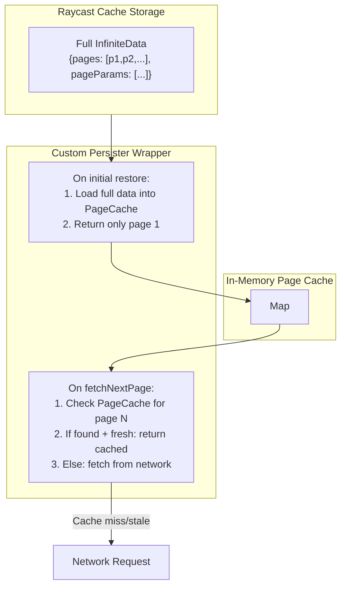

# Infinite Query Lazy Persistence

## Problem Analysis

The `experimental_createQueryPersister` stores and restores the **entire** `InfiniteData` object (`{ pages: [...], pageParams: [...] }`) as a single cache entry. When the query is first used:

1. `persisterFn` checks `query.state.data === undefined`
2. Retrieves ALL pages from storage
3. Returns the full `InfiniteData` at once
4. UI renders all 183 thoughts instead of 25

The "lazy" restoration only means "restore when query is first used" - not "restore page by page".

## Solution Architecture




## Implementation

### Step 1: Create Page Cache Module

Create a new file [apps/launcher/src/features/api/infinite-query-page-cache.ts](apps/launcher/src/features/api/infinite-query-page-cache.ts):

- Export a `Map` to hold full persisted data keyed by `queryHash`
- Export helper functions: `getPageFromCache(queryHash, pageIndex)`, `setPageCache(queryHash, data)`
- Store `dataUpdatedAt` alongside pages to respect `staleTime`

### Step 2: Create Custom Infinite Query Persister Wrapper

Modify [apps/launcher/src/features/api/query-client.ts](apps/launcher/src/features/api/query-client.ts):

Create `createInfiniteQueryPersister()` that wraps the base `queryPersister.persisterFn`:

```typescript
function createInfiniteQueryPersister(basePersister: typeof queryPersister) {
  return async function infinitePersisterFn<T, TQueryKey extends QueryKey>(
    queryFn: (ctx: QueryFunctionContext<TQueryKey>) => T | Promise<T>,
    ctx: QueryFunctionContext<TQueryKey>,
    query: Query
  ) {
    const isInfiniteQuery = "direction" in ctx || "pageParam" in ctx
    
    if (!isInfiniteQuery) {
      // Regular queries: use base persister as-is
      return basePersister.persisterFn(queryFn, ctx, query)
    }
    
    // Infinite query handling...
  }
}
```

### Step 3: Implement Initial Restore Logic

Within the wrapper, handle first page restoration:

```typescript
// Initial restore (query.state.data === undefined)
if (query.state.data === undefined) {
  const fullPersistedData = await basePersister.retrieveQuery<InfiniteData>(query.queryHash)
  
  if (fullPersistedData) {
    // Store full data in page cache for later
    pageCache.set(query.queryHash, {
      data: fullPersistedData,
      dataUpdatedAt: /* from storage metadata */
    })
    
    // Return ONLY page 1
    return {
      pages: fullPersistedData.pages.slice(0, 1),
      pageParams: fullPersistedData.pageParams.slice(0, 1)
    } as T
  }
}
```

### Step 4: Implement Subsequent Page Fetch Logic

Handle `fetchNextPage` calls by checking page cache first:

```typescript
// Subsequent pages (query.state.data exists)
const pageIndex = getPageIndexFromParam(ctx.pageParam, query)
const cachedPage = pageCache.getPage(query.queryHash, pageIndex)

if (cachedPage && !isStale(cachedPage.dataUpdatedAt, staleTime)) {
  // Return cached page
  return cachedPage.data as T
}

// Cache miss or stale: fetch from network
const networkResult = await queryFn(ctx)
// Note: base persister will handle storing the updated data
return networkResult
```

### Step 5: Update Query Client Configuration

In [apps/launcher/src/features/api/query-client.ts](apps/launcher/src/features/api/query-client.ts):

```typescript
export const createQueryClient = () =>
  new QueryClient({
    defaultOptions: {
      queries: {
        // ... existing options
        persister: createInfiniteQueryPersister(queryPersister)
      }
    }
  })
```

## Key Considerations

1. **Staleness**: Use `dataUpdatedAt` from the persisted query metadata to determine if cached pages are stale
2. **Page Index Resolution**: Map `pageParam` (cursor value) to page index using `pageParams` array from cached data
3. **Cache Invalidation**: Clear page cache entry when the query is invalidated or refetched
4. **Memory Management**: Page cache is in-memory only - cleared when extension restarts (storage is the source of truth)
5. **Fallback**: If page not in cache or stale, fall through to network fetch

## Files to Modify

- [apps/launcher/src/features/api/query-client.ts](apps/launcher/src/features/api/query-client.ts) - Main implementation
- Potentially [apps/launcher/src/features/api/index.ts](apps/launcher/src/features/api/index.ts) - Export new utilities if needed

